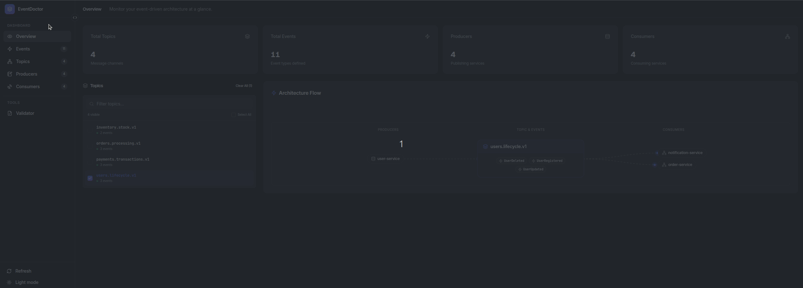

# EventDoctor

[](https://github.com/nicolascb/eventdoctor/actions/workflows/ci-backend.yml)
[](https://github.com/nicolascb/eventdoctor/actions/workflows/ci-frontend.yml)
[](LICENSE)
[](https://go.dev/dl/)
[](https://github.com/nicolascb/eventdoctor/releases)

> **Status**: 🚧 Early Prototype — in active development, not yet production-ready.

EventDoctor keeps your event-driven architecture documentation alive. Beyond cataloging, it connects specs, services, and runtime signals so producers, consumers, and architects always share the same view of the system.

## Architecture Overview

EventDoctor consists of four main components:
1. **API** — a Go server that provides a RESTful interface for managing event specs, validating them, and storing them in a PostgreSQL database.
2. **Web UI** — a React frontend built with Vite that visualizes the event mesh, shows documentation, and surfaces issues like orphaned events.
3. **CLI** — a command-line tool for validating and publishing `eventdoctor.yaml` specs from your local environment or CI/CD pipelines.
4. **Auditor** — a background service that monitors the event mesh for undocumented events and consumers.

## Web UI

Browse topics, events, producers, and consumers in real-time. See orphaned events and schema details at a glance.



## What You Get

- **Living Catalog**: centralizes `eventdoctor.yaml` specs from every service.
- **Documentation Automation**: generates up-to-date docs for events, schemas, and relationships.
- **Validation & Governance**: enforces ownership, versioning, and schema rules before they reach production.
- **Monitoring Hooks**: surfaces orphaned, unconsumed, or drifting events.

## Quick Start

No Go installation required. Clone and run the full stack:

```bash
git clone https://github.com/nicolascb/eventdoctor.git
cd eventdoctor
docker-compose up
```

- API: http://localhost:8087
- Web UI: http://localhost:5193
- Docs: http://localhost:4321

Or run directly with the published Docker images:

```bash
# API (with demo data)
docker run -p 8087:8087 -e WITH_MOCK=1 ghcr.io/nicolascb/eventdoctor:latest

# Web UI
docker run -p 5173:80 -e VITE_API_URL=http://localhost:8087 ghcr.io/nicolascb/eventdoctor-ui:latest
```

For full setup, CLI usage, and CI/CD integration see the **[documentation](https://nicolascb.github.io/eventdoctor)**.

EventDoctor keeps teams aligned as your event mesh evolves.
