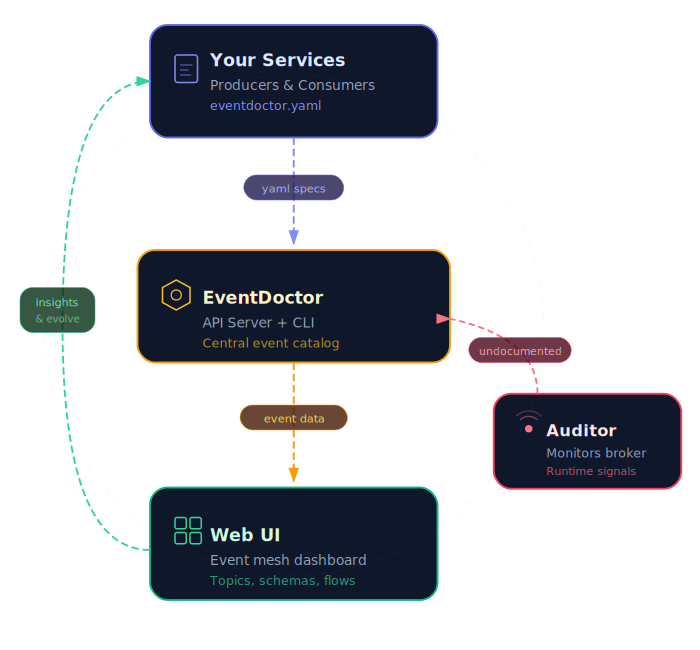

# EventDoctor

[](https://github.com/nicolascb/eventdoctor/actions/workflows/ci-backend.yml)
[](https://github.com/nicolascb/eventdoctor/actions/workflows/ci-frontend.yml)
[](LICENSE)
[](https://github.com/nicolascb/eventdoctor/releases)

> **Status**: 🚧 Early Prototype — in active development, not yet production-ready.

In event-driven architectures, documentation drifts from reality fast. Schemas change, new consumers appear, topics multiply — and suddenly nobody knows what's connected to what.

**EventDoctor** keeps your event-driven architecture documentation alive. Each service declares an `eventdoctor.yaml` spec with the events it produces and consumes. The platform validates, catalogs, and connects everything — so producers, consumers, and architects always share the same view of the system.

<p align="center">
  
</p>

## Quick Start

```bash
git clone https://github.com/nicolascb/eventdoctor.git
cd eventdoctor
docker-compose up
```

API → `localhost:8087` · Web UI → `localhost:5193` · Docs → `localhost:4321`

## Documentation

Full setup, spec reference, CLI usage, and architecture details are available at **[nicolascb.github.io/eventdoctor](https://nicolascb.github.io/eventdoctor)**.
