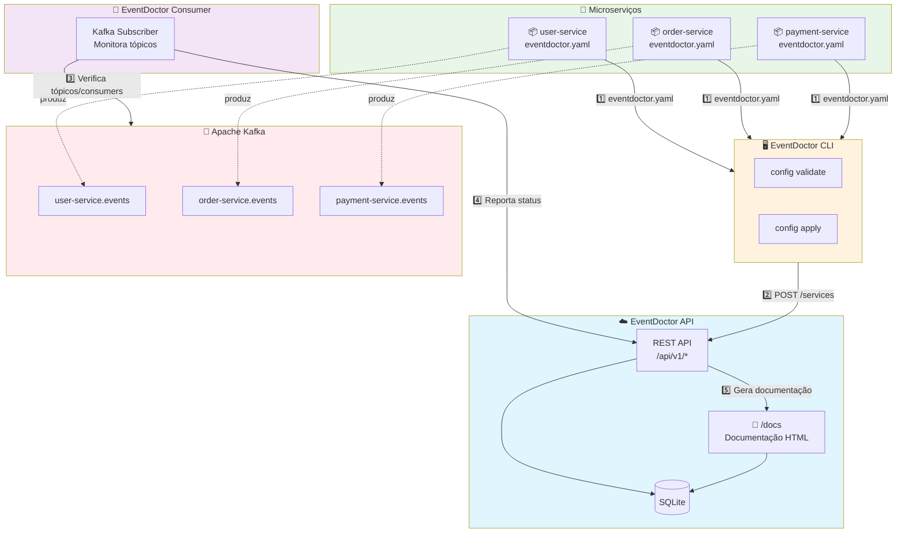

# EventDoctor

Projeto de código aberto para gerenciamento e documentação de eventos em sistemas distribuídos.

É capaz de gerar documentação automática, validar conformidade de eventos e facilitar a comunicação entre produtores e consumidores de eventos.

## Arquitetura



### Fluxo Principal

1. **Configuração**: Cada microserviço define seu `eventdoctor.yaml` com produtores e consumidores
2. **Registro**: A CLI valida e envia as configurações para a API
3. **Monitoramento**: O Consumer verifica periodicamente os tópicos no Kafka
4. **Documentação**: A API gera documentação automática de todos os eventos do ecossistema

- [EventDoctor](#eventdoctor)
  - [Plataformas suportadas](#plataformas-suportadas)
  - [API Server](#api-server)
  - [Consumer](#consumer)
  - [CLI](#cli)
  - [Como funciona o arquivo de configuração](#como-funciona-o-arquivo-de-configuração)
    - [Visão Geral](#visão-geral)
    - [Estrutura do Arquivo](#estrutura-do-arquivo)
    - [Especificação Detalhada dos Campos](#especificação-detalhada-dos-campos)
      - [Campos Globais](#campos-globais)
      - [Producers](#producers)
      - [Consumers](#consumers)
    - [Exemplos de Uso](#exemplos-de-uso)
      - [Produtor Simples](#produtor-simples)
      - [Consumidor Múltiplos Tópicos](#consumidor-múltiplos-tópicos)
      - [Produtor Não-Owner](#produtor-não-owner)
    - [Validações](#validações)
    - [Casos de Uso Avançados](#casos-de-uso-avançados)
      - [Versionamento de Eventos](#versionamento-de-eventos)


## Plataformas suportadas

- Kafka

## API Server

O eventdoctor-api é um serviço que expõe uma API REST para interagir com o EventDoctor. Ele permite que os usuários consultem informações sobre eventos, produtores e consumidores, além de fornecer endpoints para validação de eventos e geração de documentação.

Rota de documentação HTML estática:
- GET /docs: Lista tópicos, eventos, produtores e consumidores em tabela filtrável.


## Consumer

Informações sobre o consumidor de eventos Kafka estão em [CONSUMER.md](CONSUMER.md).

## CLI

Ferramenta de linha de comando para interagir com o EventDoctor. Documentação em [CLI.md](CLI.md).

## Como funciona o arquivo de configuração

### Visão Geral

O EventDoctor utiliza um arquivo de configuração YAML para definir produtores e consumidores de eventos. Este arquivo serve como um registro central de todos os eventos em seu sistema, permitindo rastreamento, versionamento e documentação automática.

Cada projeto que produz ou consome eventos deve ter um arquivo `eventdoctor.yml`.

### Estrutura do Arquivo

```yaml
# eventdoctor.yml
version: "1.0"

service: "chat-microservice"
config:
  servers:
    - environment: "development"
      url: "http://localhost:8080"
    - environment: "production"
      url: "https://eventdoctor.empresa.com"
  repository: "https://github.com/empresa/chat-microservice"

producers:
  - topic: "chat-microservice.events"
    owner: true
    writes: true
    title: "Chat Events"
    description: "Eventos relacionados ao sistema de chat"
    events:
      - type: "ChatCreated"
        version: "1.0.0"
        description: "Disparado quando um novo chat é criado"
        schema_url: "https://gitlab.com/nicolascorrea/eventdoctor/schemas/chat_created.json"
      - type: "ChatDeleted"
        version: "1.0.0"
        description: "Disparado quando um chat é removido"
        schema_url: "https://gitlab.com/nicolascorrea/eventdoctor/schemas/chat_deleted.json"

consumers:
  - group: "notification-group"
    description: "Serviço responsável por notificações push"
    topics:
      - name: "chat-microservice.events"
        events:
          - type: "ChatCreated"
            version: "1.0.0"
          - type: "ChatDeleted"
            version: "1.0.0"
      - name: "user-microservice.events"
        events:
          - type: "UserRegistered"
            version: "1.0.0"
```

### Especificação Detalhada dos Campos

#### Campos Globais

| Campo                        | Tipo   | Descrição                                          | Obrigatório | Padrão |
| ---------------------------- | ------ | -------------------------------------------------- | ----------- | ------ |
| version                      | string | Versão da especificação                            | sim         | -      |
| service                      | string | Nome do serviço que define esta configuração       | sim         | -      |
| config                       | object | Configuração global do projeto                     | sim         | -      |
| config.repository            | string | URL do repositório                                 | sim         | -      |
| config.servers               | array  | Lista de servidores EventDoctor                    | sim         | -      |
| config.servers[].environment | string | Ambiente do servidor (ex: development, production) | sim         | -      |
| config.servers[].url         | string | URL do servidor EventDoctor                        | sim         | -      |

#### Producers

| Campo                          | Tipo    | Descrição                                           | Obrigatório           | Exemplo / Padrão           |
| ------------------------------ | ------- | --------------------------------------------------- | --------------------- | -------------------------- |
| topic                          | string  | Nome do tópico                                      | sim                   | "chat-microservice.events" |
| title                          | string  | Título legível do tópico                            | sim se owner for true | "Chat Events"              |
| owner                          | boolean | Define se este serviço é responsável pelo schema    | sim                   | true                       |
| writes                         | boolean | Define se este serviço escreve eventos neste tópico | não                   | true                       |
| description                    | string  | Descrição do propósito do tópico                    | não                   | "Eventos do sistema..."    |
| events                         | array   | Lista de eventos produzidos ou documentados         | sim                   | -                          |
| events[].type                  | string  | Tipo/nome do evento                                 | sim                   | "ChatCreated"              |
| events[].version               | string  | Versão do schema do evento (semantic versioning)    | sim                   | "1.0.0"                    |
| events[].description           | string  | Descrição do evento                                 | não                   | "Disparado quando..."      |
| events[].schema_url            | string  | URL do JSON Schema do evento                        | sim se owner for true | "https://..."              |
| events[].headers               | array   | Headers HTTP opcionais para o evento                | não                   | -                          |
| events[].headers[].name        | string  | Nome do header                                      | sim                   | "X-Request-ID"             |
| events[].headers[].description | string  | Descrição do header                                 | não                   | "Identificador único..."   |

#### Consumers

| Campo                     | Tipo   | Descrição                                    | Obrigatório | Exemplo                      |
| ------------------------- | ------ | -------------------------------------------- | ----------- | ---------------------------- |
| group                     | string | Grupo de consumidores (Kafka consumer group) | sim         | "notification-group"         |
| description               | string | Descrição do consumidor                      | não         | "Serviço de notificações..." |
| topics                    | array  | Lista de tópicos consumidos                  | sim         | -                            |
| topics[].name             | string | Nome do tópico                               | sim         | "chat-microservice.events"   |
| topics[].events           | array  | Lista de eventos consumidos                  | sim         | -                            |
| topics[].events[].type    | string | Tipo do evento                               | sim         | "ChatCreated"                |
| topics[].events[].version | string | Versão do evento que será consumida          | não         | "1.0.0"                      |

### Exemplos de Uso

#### Produtor Simples
```yaml
service: "user-service"
config:
  repository: "https://github.com/empresa/user-service"
  servers:
    - environment: "production"
      url: "https://eventdoctor.empresa.com"

producers:
  - topic: "user-service.events"
    owner: true
    writes: true
    title: "User Events"
    events:
      - type: "UserRegistered"
        version: "1.0.0"
        schema_url: "https://schemas.empresa.com/user_registered.json"
```

#### Consumidor Múltiplos Tópicos
```yaml
service: "analytics-service"
config:
  repository: "https://github.com/empresa/analytics-service"
  servers:
    - environment: "production"
      url: "https://eventdoctor.empresa.com"

consumers:
  - group: "analytics-group"
    description: "Analytics de eventos"
    topics:
      - name: "user-service.events"
        events:
          - type: "UserRegistered"
            version: "1.0.0"
          - type: "UserDeleted"
            version: "1.0.0"
      - name: "chat-service.events"
        events:
          - type: "ChatCreated"
            version: "1.0.0"
```

#### Produtor Não-Owner (escreve mas não é dono do schema)
```yaml
service: "gateway-service"
config:
  repository: "https://github.com/empresa/gateway-service"
  servers:
    - environment: "production"
      url: "https://eventdoctor.empresa.com"

producers:
  - topic: "user-service.events"  # Tópico de outro serviço
    owner: false
    writes: true
    events:
      - type: "UserLoggedIn"  # Escreve mas não define schema
        version: "1.0.0"
```

#### Produtor que apenas documenta schema (não escreve)
```yaml
service: "schema-registry-service"
config:
  repository: "https://github.com/empresa/schema-registry"
  servers:
    - environment: "production"
      url: "https://eventdoctor.empresa.com"

producers:
  - topic: "user-service.events"
    owner: true
    writes: false  # Define o schema mas não produz eventos
    title: "User Events"
    events:
      - type: "UserRegistered"
        version: "1.0.0"
        schema_url: "https://schemas.empresa.com/user_registered.json"
```

### Validações

1. **Tópicos únicos por owner**: Apenas um serviço pode ser owner (`owner: true`) de um tópico
2. **Schema obrigatório para owners**: Serviços com `owner: true` devem fornecer `schema_url`
3. **Versões em tudo**: Todos os eventos devem ter versão seguindo semantic versioning (x.y.z)
4. **Referências válidas**: Eventos consumidos devem existir em algum produtor
5. **Consistência writes/owner**: 
   - Se `owner: true` e `writes: false`, é um provider de schema apenas
   - Se `owner: false` e `writes: true`, apenas produz sem responsabilidade do schema
   - Se `owner: true` e `writes: true`, é o produtor completo (padrão)

### Casos de Uso Avançados

#### Versionamento de Eventos
```yaml
service: "order-service"
config:
  repository: "https://github.com/empresa/order-service"
  servers:
    - environment: "production"
      url: "https://eventdoctor.empresa.com"

producers:
  - topic: "order-service.events"
    owner: true
    writes: true
    title: "Order Events"
    events:
      - type: "OrderCreated"
        version: "2.0.0"
        description: "Nova versão com campo adicional 'priority'"
        schema_url: "https://schemas.empresa.com/order_created_v2.json"
      - type: "OrderCreated"
        version: "1.0.0"
        description: "Versão legada"
        schema_url: "https://schemas.empresa.com/order_created_v1.json"
```

#### Eventos com Headers HTTP
```yaml
service: "payment-service"
config:
  repository: "https://github.com/empresa/payment-service"
  servers:
    - environment: "production"
      url: "https://eventdoctor.empresa.com"

producers:
  - topic: "payment-service.events"
    owner: true
    writes: true
    title: "Payment Events"
    events:
      - type: "PaymentProcessed"
        version: "1.0.0"
        description: "Disparado quando um pagamento é processado"
        schema_url: "https://schemas.empresa.com/payment_processed.json"
        headers:
          - name: "X-Request-ID"
            description: "Identificador único da requisição"
          - name: "X-Correlation-ID"
            description: "ID de correlação para rastreamento"
          - name: "X-User-ID"
            description: "ID do usuário que realizou o pagamento"
```
        schema_url: "https://schemas.empresa.com/order_created_v1.json"
```
