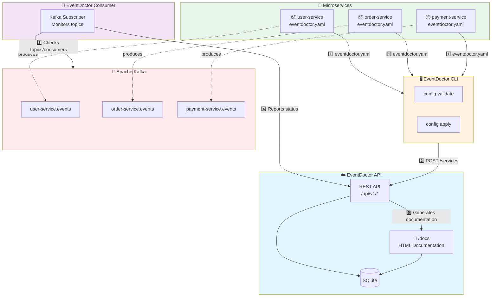

# EventDoctor

Open source project for managing and documenting events in distributed systems.

It can generate automatic documentation, validate event compliance, and facilitate communication between event producers and consumers.

## Architecture



### Main Flow

1. **Configuration**: Each microservice defines its `eventdoctor.yaml` with producers and consumers
2. **Registration**: The CLI validates and sends configurations to the API
3. **Monitoring**: The Consumer periodically checks topics in Kafka
4. **Documentation**: The API generates automatic documentation for all events in the ecosystem

- [EventDoctor](#eventdoctor)
  - [Supported Platforms](#supported-platforms)
  - [API Server](#api-server)
  - [Consumer](#consumer)
  - [CLI](#cli)
  - [How the Configuration File Works](#how-the-configuration-file-works)
    - [Overview](#overview)
    - [File Structure](#file-structure)
    - [Detailed Field Specification](#detailed-field-specification)
      - [Global Fields](#global-fields)
      - [Producers](#producers)
      - [Consumers](#consumers)
    - [Usage Examples](#usage-examples)
      - [Simple Producer](#simple-producer)
      - [Multiple Topics Consumer](#multiple-topics-consumer)
      - [Non-Owner Producer](#non-owner-producer)
    - [Validations](#validations)
    - [Advanced Use Cases](#advanced-use-cases)
      - [Event Versioning](#event-versioning)


## Supported Platforms

- Kafka

## API Server

The eventdoctor-api is a service that exposes a REST API to interact with EventDoctor. It allows users to query information about events, producers, and consumers, as well as providing endpoints for event validation and documentation generation.

Static HTML documentation route:
- GET /docs: Lists topics, events, producers, and consumers in a filterable table.


## Consumer

Information about the Kafka event consumer is available in [CONSUMER.md](CONSUMER.md).

## CLI

Command line tool to interact with EventDoctor. Documentation in [CLI.md](CLI.md).

## How the Configuration File Works

### Overview

EventDoctor uses a YAML configuration file to define event producers and consumers. This file serves as a central registry of all events in your system, enabling tracking, versioning, and automatic documentation.

Each project that produces or consumes events should have an `eventdoctor.yml` file.

### File Structure

```yaml
# eventdoctor.yml
version: "1.0"

service: "payment-microservice"
config:
  servers:
    - environment: "development"
      url: "http://localhost:8080"
    - environment: "production"
      url: "https://eventdoctor.empresa.com"
  repository: "https://github.com/empresa/payment-microservice"

producers:
  - topic: "payment-microservice.events"
    owner: true
    writes: true
    title: "Payment Events"
    description: "Events related to the payment system"
    events:
      - type: "PaymentCreated"
        version: "1.0.0"
        description: "Fired when a new payment is created"
        schema_url: "https://gitlab.com/nicolascorrea/eventdoctor/schemas/payment_created.json"
      - type: "PaymentRefunded"
        version: "1.0.0"
        description: "Fired when a payment is refunded"
        schema_url: "https://gitlab.com/nicolascorrea/eventdoctor/schemas/payment_refunded.json"

consumers:
  - group: "notification-group"
    description: "Service responsible for push notifications"
    topics:
      - name: "payment-microservice.events"
        events:
          - type: "PaymentCreated"
            version: "1.0.0"
          - type: "PaymentRefunded"
            version: "1.0.0"
      - name: "user-microservice.events"
        events:
          - type: "UserRegistered"
            version: "1.0.0"
```

### Detailed Field Specification

#### Global Fields

| Field                        | Type   | Description                                        | Required | Default |
| ---------------------------- | ------ | -------------------------------------------------- | -------- | ------- |
| version                      | string | Specification version                              | yes      | -       |
| service                      | string | Service name defining this configuration           | yes      | -       |
| config                       | object | Global project configuration                       | yes      | -       |
| config.repository            | string | Repository URL                                     | yes      | -       |
| config.servers               | array  | List of EventDoctor servers                        | yes      | -       |
| config.servers[].environment | string | Server environment (e.g.: development, production) | yes      | -       |
| config.servers[].url         | string | EventDoctor server URL                             | yes      | -       |

#### Producers

| Field                          | Type    | Description                                           | Required             | Example / Default             |
| ------------------------------ | ------- | ----------------------------------------------------- | -------------------- | ----------------------------- |
| topic                          | string  | Topic name                                            | yes                  | "payment-microservice.events" |
| title                          | string  | Human-readable topic title                            | yes if owner is true | "Payment Events"              |
| owner                          | boolean | Defines if this service is responsible for the schema | yes                  | true                          |
| writes                         | boolean | Defines if this service writes events to this topic   | no                   | true                          |
| description                    | string  | Description of the topic's purpose                    | no                   | "System events..."            |
| events                         | array   | List of produced or documented events                 | yes                  | -                             |
| events[].type                  | string  | Event type/name                                       | yes                  | "PaymentCreated"              |
| events[].version               | string  | Event schema version (semantic versioning)            | yes                  | "1.0.0"                       |
| events[].description           | string  | Event description                                     | no                   | "Fired when..."               |
| events[].schema_url            | string  | Event JSON Schema URL                                 | yes if owner is true | "https://..."                 |
| events[].headers               | array   | Optional HTTP headers for the event                   | no                   | -                             |
| events[].headers[].name        | string  | Header name                                           | yes                  | "X-Request-ID"                |
| events[].headers[].description | string  | Header description                                    | no                   | "Unique identifier..."        |

#### Consumers

| Field                     | Type   | Description                           | Required | Example                       |
| ------------------------- | ------ | ------------------------------------- | -------- | ----------------------------- |
| group                     | string | Consumer group (Kafka consumer group) | yes      | "notification-group"          |
| description               | string | Consumer description                  | no       | "Notification service..."     |
| topics                    | array  | List of consumed topics               | yes      | -                             |
| topics[].name             | string | Topic name                            | yes      | "payment-microservice.events" |
| topics[].events           | array  | List of consumed events               | yes      | -                             |
| topics[].events[].type    | string | Event type                            | yes      | "PaymentCreated"              |
| topics[].events[].version | string | Event version to be consumed          | no       | "1.0.0"                       |

### Usage Examples

#### Simple Producer
```yaml
service: "user-service"
config:
  repository: "https://github.com/empresa/user-service"
  servers:
    - environment: "production"
      url: "https://eventdoctor.empresa.com"

producers:
  - topic: "user-service.events"
    owner: true
    writes: true
    title: "User Events"
    events:
      - type: "UserRegistered"
        version: "1.0.0"
        schema_url: "https://schemas.empresa.com/user_registered.json"
```

#### Multiple Topics Consumer
```yaml
service: "analytics-service"
config:
  repository: "https://github.com/empresa/analytics-service"
  servers:
    - environment: "production"
      url: "https://eventdoctor.empresa.com"

consumers:
  - group: "analytics-group"
    description: "Event analytics"
    topics:
      - name: "user-service.events"
        events:
          - type: "UserRegistered"
            version: "1.0.0"
          - type: "UserDeleted"
            version: "1.0.0"
      - name: "order-service.events"
        events:
          - type: "OrderCreated"
            version: "1.0.0"
```

#### Non-Owner Producer (writes but doesn't own the schema)
```yaml
service: "gateway-service"
config:
  repository: "https://github.com/empresa/gateway-service"
  servers:
    - environment: "production"
      url: "https://eventdoctor.empresa.com"

producers:
  - topic: "user-service.events"  # Topic from another service
    owner: false
    writes: true
    events:
      - type: "UserLoggedIn"  # Writes but doesn't define schema
        version: "1.0.0"
```

#### Schema-only Producer (doesn't write)
```yaml
service: "schema-registry-service"
config:
  repository: "https://github.com/empresa/schema-registry"
  servers:
    - environment: "production"
      url: "https://eventdoctor.empresa.com"

producers:
  - topic: "user-service.events"
    owner: true
    writes: false  # Defines the schema but doesn't produce events
    title: "User Events"
    events:
      - type: "UserRegistered"
        version: "1.0.0"
        schema_url: "https://schemas.empresa.com/user_registered.json"
```

### Validations

1. **Unique topics per owner**: Only one service can be owner (`owner: true`) of a topic
2. **Schema required for owners**: Services with `owner: true` must provide `schema_url`
3. **Versions everywhere**: All events must have a version following semantic versioning (x.y.z)
4. **Valid references**: Consumed events must exist in some producer
5. **writes/owner consistency**: 
   - If `owner: true` and `writes: false`, it's a schema provider only
   - If `owner: false` and `writes: true`, it only produces without schema responsibility
   - If `owner: true` and `writes: true`, it's the complete producer (default)

### Advanced Use Cases

#### Event Versioning
```yaml
service: "order-service"
config:
  repository: "https://github.com/empresa/order-service"
  servers:
    - environment: "production"
      url: "https://eventdoctor.empresa.com"

producers:
  - topic: "order-service.events"
    owner: true
    writes: true
    title: "Order Events"
    events:
      - type: "OrderCreated"
        version: "2.0.0"
        description: "New version with additional 'priority' field"
        schema_url: "https://schemas.empresa.com/order_created_v2.json"
      - type: "OrderCreated"
        version: "1.0.0"
        description: "Legacy version"
        schema_url: "https://schemas.empresa.com/order_created_v1.json"
```

#### Events with HTTP Headers
```yaml
service: "payment-service"
config:
  repository: "https://github.com/empresa/payment-service"
  servers:
    - environment: "production"
      url: "https://eventdoctor.empresa.com"

producers:
  - topic: "payment-service.events"
    owner: true
    writes: true
    title: "Payment Events"
    events:
      - type: "PaymentProcessed"
        version: "1.0.0"
        description: "Fired when a payment is processed"
        schema_url: "https://schemas.empresa.com/payment_processed.json"
        headers:
          - name: "X-Request-ID"
            description: "Unique request identifier"
          - name: "X-Correlation-ID"
            description: "Correlation ID for tracing"
          - name: "X-User-ID"
            description: "ID of the user who made the payment"
```
        schema_url: "https://schemas.empresa.com/order_created_v1.json"
```
