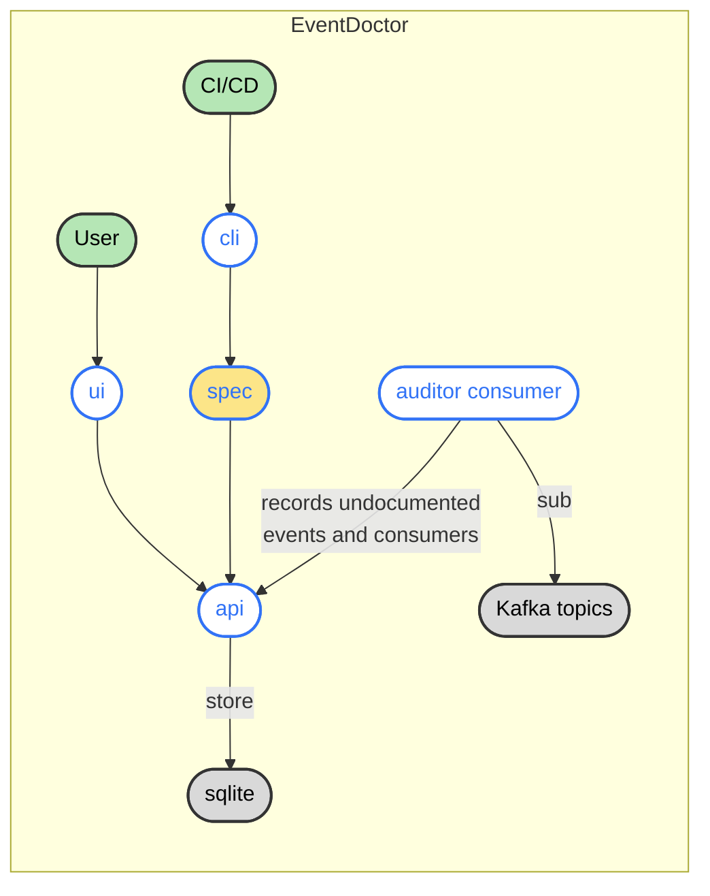

# EventDoctor

**Status**: 🚧 Early Prototype (in active development, not production-ready) 🚧

EventDoctor keeps your event-driven architecture documentation alive. Beyond cataloging, it connects specs, services, and runtime signals so producers, consumers, and architects always share the same view of the system.

## Architecture Overview

Components:

| Component        | Description                                                     |
| ---------------- | --------------------------------------------------------------- |
| API              | REST API for managing event specs                               |
| CLI              | Command-line tool for validating and publishing specs           |
| Auditor Consumer | Consumes events and records undocumented events and consumers   |
| Frontend UI      | Web interface for browsing events, topics, producers, consumers |

## UI Screenshot

## What You Get

- **Living Catalog**: centralizes `eventdoctor.yaml` specs from every service.
- **Documentation Automation**: generates up-to-date docs for events, schemas, and relationships.
- **Validation & Governance**: enforces ownership, versioning, and schema rules before they reach production.
- **Monitoring Hooks**: surfaces orphaned, unconsumed, or drifting events.

## Project Pieces

- `backend/`: REST API, spec persistence, validation pipeline, Kafka monitors.
- `frontend/`: UI for browsing topics, events, producers, and consumers.
- `cli/`: developer tooling for validating and publishing `eventdoctor.yaml`.

Each submodule ships its own README with setup and usage details.

## Run demo lab

1. Start API with `cd backend && WITH_MOCK=1 go run ./cmd/api/main.go`.
2. Start UI with `cd frontend && npm install && npm run dev`.
3. Open the web UI to explore live documentation.

EventDoctor keeps teams aligned as your event mesh evolves.
