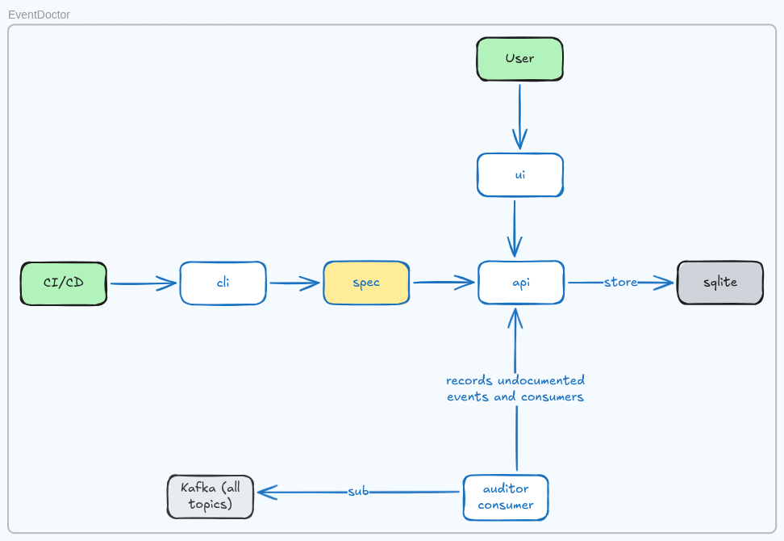

import { Aside } from '@astrojs/starlight/components';

EventDoctor is composed of four main components that work together to provide a living catalog of your event-driven architecture.

## Components

| Component | Stack | Description |
| :-- | :-- | :-- |
| **API** | Go, SQLite | REST API for receiving, validating, and serving event specs. |
| **CLI** | Go | Command-line tool for validating and publishing `eventdoctor.yaml` specs. |
| **Frontend** | React, TypeScript, Vite, Tailwind CSS | Web dashboard for navigating topics, events, producers, and consumers. |
| **Auditor Consumer** | Go | Background process that connects to message brokers to detect undocumented events. |

## System Diagram



### Data Flow

1. **Developer / CI** pushes code with an `eventdoctor.yaml` file.
2. **CLI** validates the spec locally and publishes it to the **API**.
3. **API** parses the spec and stores topics, events, producers, and consumers in **SQLite**.
4. **Frontend** fetches data from the API and renders the dashboard.
5. **Auditor** (optional) subscribes to live broker topics and reports undocumented events back to the API.

## Project Structure

```
eventdoctor/
├── backend/
│   ├── cmd/
│   │   ├── api/           # API entry point
│   │   ├── auditor/       # Auditor consumer entry point
│   │   └── cli/           # CLI entry point
│   ├── internal/
│   │   ├── api/           # HTTP handlers, router, middleware
│   │   ├── client/        # HTTP client for CLI → API communication
│   │   ├── commands/      # CLI command implementations
│   │   ├── db/            # SQLite database, repository, models
│   │   ├── eventdoctor/   # Spec types, parsing, validation
│   │   ├── logger/        # Structured logging
│   │   └── service/       # Business logic layer
│   └── examples/          # Sample eventdoctor.yaml files
├── frontend/
│   └── src/
│       ├── components/    # React view components
│       ├── hooks/         # Data fetching hooks
│       ├── lib/           # API client
│       └── types/         # TypeScript type definitions
├── website/               # This documentation site (Astro + Starlight)
└── docker-compose.yml     # Run the full stack
```

## Tech Stack

| Layer | Technology |
| :-- | :-- |
| **Backend** | Go 1.22+, `net/http` (stdlib), SQLite, `go-playground/validator` |
| **Frontend** | React 19, TypeScript, Vite, Tailwind CSS, shadcn/ui |
| **CLI** | Go, `urfave/cli/v3` |
| **Database** | SQLite (via `mattn/go-sqlite3`) |
| **CI/CD** | GitHub Actions |

<Aside>
The backend uses Go's standard library `net/http` mux (Go 1.22+ pattern matching) — no external router framework.
</Aside>
