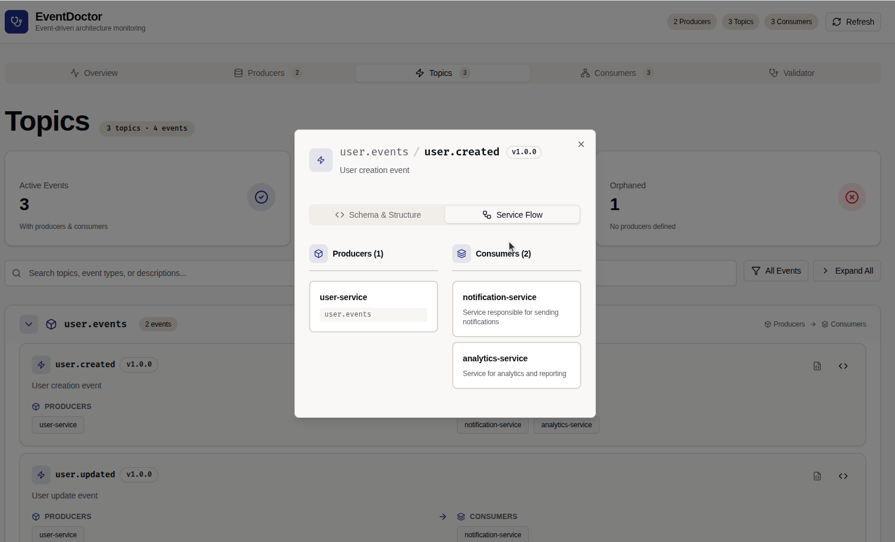

import { Aside } from '@astrojs/starlight/components';

The EventDoctor Web UI provides a visual dashboard for exploring your event-driven architecture. It connects to the API and presents all topics, events, producers, and consumers in a navigable interface.

## Views

### Overview

The landing page of the Web UI shows a high-level summary:

- Total number of **producers**, **topics**, and **consumers**.
- A list of all topics with event counts.
- Quick access to detailed views.

### Topics

Browse all topics in your event mesh. Each topic card shows:

- The topic name and number of events.
- Stats for **active events** and **orphaned events**.
- Expand to see individual events with their producers and consumers.

Clicking on an event opens the **Event Detail** side panel with schema, headers, and service flow information.

### Producers

Lists all producing services. Each producer entry shows:

- The service name and repository link.
- Topics the service writes to.
- Number of events published.

### Consumers

Lists all consumer groups. Each consumer entry shows:

- The consumer group name and description.
- Topics subscribed to.
- Events consumed from each topic.

### Event Detail

The Event Detail panel (opened from Topics, Producers, or Consumers views) shows:

- **Schema & Structure** — the event schema URL and custom headers.
- **Service Flow** — which producers emit this event and which consumers listen to it.

<Aside>
Use the search bar available on every listing view to filter by topic name, event name, service name, or description.
</Aside>
